# ClassFlow Prime

<div align="center">

**A scalable, all-in-one education management platform** that centralizes class operations, communication, exams, and member collaboration into a structured digital workspace.

[](https://classflow-prime.vercel.app/)
[](https://nextjs.org/)
[](https://nestjs.com/)
[](https://www.mongodb.com/)
[](https://www.typescriptlang.org/)

</div>

---

## Table of Contents

- [Overview](#overview)
- [Features](#features)
- [Tech Stack](#tech-stack)
- [Pages & Modules](#pages--modules)
- [Screenshots](#screenshots)
- [Live Demo](#live-demo)
- [Getting Started](#getting-started)
- [Folder Structure](#folder-structure)
- [Author](#author)

---

## Overview

**ClassFlow Prime** is a full-stack education management platform designed to streamline academic operations for students, instructors, and administrators. It provides a centralized digital workspace for managing class updates, exam schedules, study groups, member roles, faculty assignments, and real-time notifications.

Built with a modern monorepo architecture, the platform consists of a **Next.js 16** frontend and a **NestJS 11** backend, connected via RESTful APIs and powered by **MongoDB Atlas** for data persistence. The UI is crafted with **Tailwind CSS 4**, **shadcn/ui**, and **Framer Motion** for a polished, responsive experience across desktop and mobile devices.

---

## Features

### Class Management
- **Create & Enroll** — Create new classes or join existing ones via class codes
- **Class Updates** — Post announcements, share materials, pin important updates, and track read status
- **Class Groups** — Organize students into groups within a class for collaborative work
- **Class Settings** — Manage join permissions, regenerate class codes, leave or delete classes
- **Routine Management** — Create, edit, and delete class schedules with day-of-week and period-based time slots

### Member & Role Management
- **Member Management** — View, add, and revoke class members with role-based access control
- **Faculty Assignment** — Assign and manage faculty members per class with dedicated roles
- **Role-Based Guards** — Fine-grained permissions using class roles, agent permissions, and user roles

### AI Agent System
- **Agent Management** — Create, manage, and delete AI agents per class
- **Agent-Powered Updates** — Agents can post class updates on behalf of instructors
- **Agent Search** — Search and discover agents across enrolled classes

### Notifications
- **Push Notifications** — Real-time browser push notifications via Web Push API
- **Notification Center** — Filter, read, and manage all notifications grouped by date
- **Notification Types** — Class updates, member changes, faculty assignments, and more

### Authentication & Profiles
- **Secure Auth** — JWT-based authentication with HTTP-only cookies
- **Email Verification** — OTP-based email verification during sign-up
- **Password Reset** — Forgot password flow with OTP verification
- **Profile Management** — Update personal info, upload avatars (Cloudinary), manage preferences
- **Brave Push Support** — Special handling for Brave browser push notifications

### Dashboard
- **Overview Dashboard** — Unified view of enrolled classes, recent activity, and quick actions
- **Class Cards** — Beautiful themed cards with cover images, status badges, and metadata

---

## Tech Stack

| Layer | Technology |
|---|---|
| **Frontend** | Next.js 16, React 19, TypeScript 5 |
| **Backend** | NestJS 11, Node.js, TypeScript 5 |
| **Database** | MongoDB 9 (Mongoose ODM) |
| **State Management** | Redux Toolkit, React Redux |
| **UI Framework** | Tailwind CSS 4, shadcn/ui, Radix UI |
| **Animations** | Framer Motion |
| **Icons** | Lucide React |
| **Media Storage** | Cloudinary |
| **Authentication** | JWT (Passport.js), bcrypt |
| **Email** | Nodemailer, Handlebars templates |
| **Push Notifications** | Web Push API |
| **Validation** | class-validator, class-transformer |
| **API Docs** | Swagger (NestJS Swagger) |
| **Deployment** | Vercel (frontend + serverless backend) |
| **CI/CD** | GitHub Actions, Semantic Release |

---

## Pages & Modules

### Frontend Pages (`web/src/app/`)

| Route | Description |
|---|---|
| `/sign-in` | Sign-in page with email/password |
| `/sign-up` | Multi-step registration (info → email → OTP → success) |
| `/forgot-password` | Password reset flow (email → OTP → new password) |
| `/` | Dashboard — overview of enrolled classes |
| `/classes` | My Classes — list with search, filter (Active/Ended/Upcoming/All) |
| `/classes/create` | Create a new class |
| `/classes/enroll` | Join a class via code |
| `/classes/[classId]/updates` | Class updates feed |
| `/classes/[classId]/members` | Class member management |
| `/classes/[classId]/groups` | Class group management |
| `/classes/[classId]/settings` | Class settings (join code, delete, leave) |
| `/classes/[classId]/routine` | Class routine/schedule management |
| `/classes/[classId]/faculty` | Faculty assignment management |
| `/classes/[classId]/agent` | AI agent management |
| `/profile` | User profile, preferences, enrolled classes |
| `/notifications` | Notification center with filters |

### Backend Modules (`server/src/modules/`)

| Module | Description |
|---|---|
| `auth` | Authentication — sign-in, sign-up, sign-out, password reset, token management |
| `class` | Core class CRUD, enrollment, settings, members, groups, updates, faculty |
| `agent` | AI agent management — create, search, delete, agent-permissioned actions |
| `routine` | Class schedule/routine — slots, periods, days of week |
| `dashboard` | Dashboard data aggregation |
| `profile` | User profile — fetch, update, avatar upload |
| `notification` | Notification CRUD, push subscriptions, unread counts |

---

## Screenshots

<div align="center">

### Dashboard Mockup


---

### Desktop Dashboard

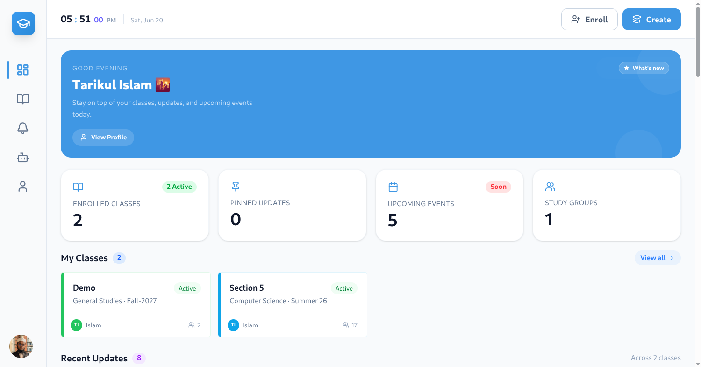

### Mobile Dashboard

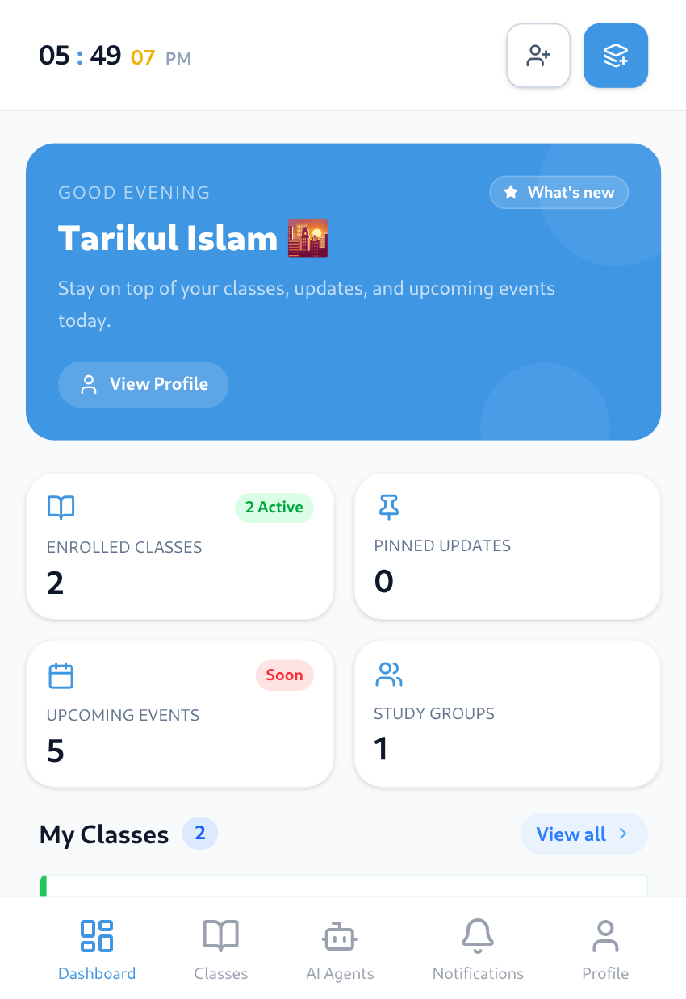

---

### All Classes

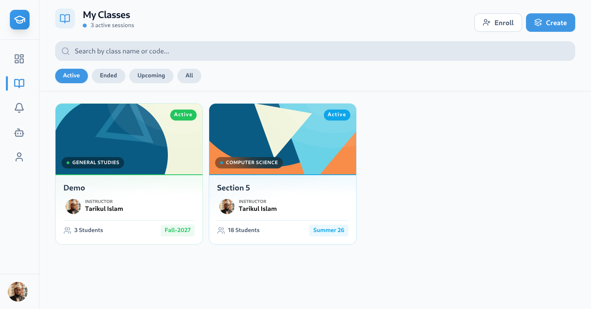

### Class Groups

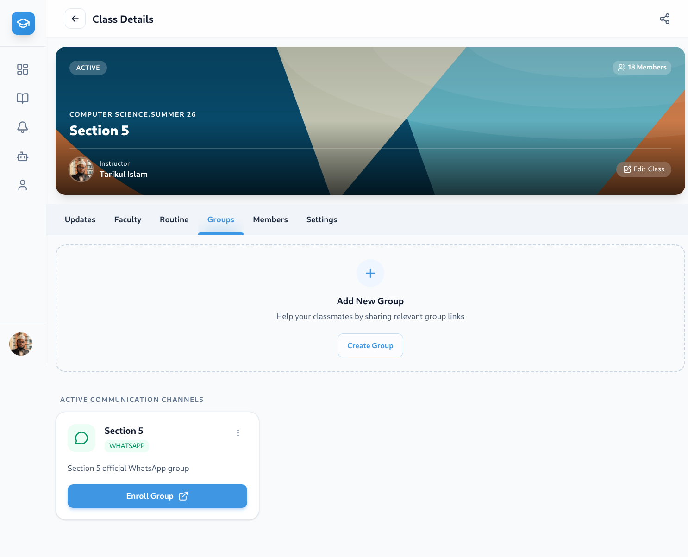

### Class Members

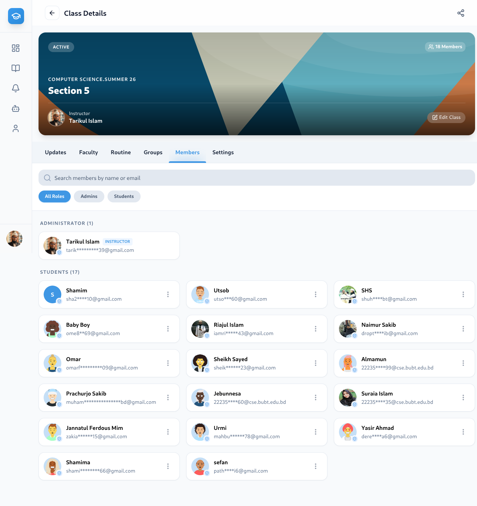

### Class Settings

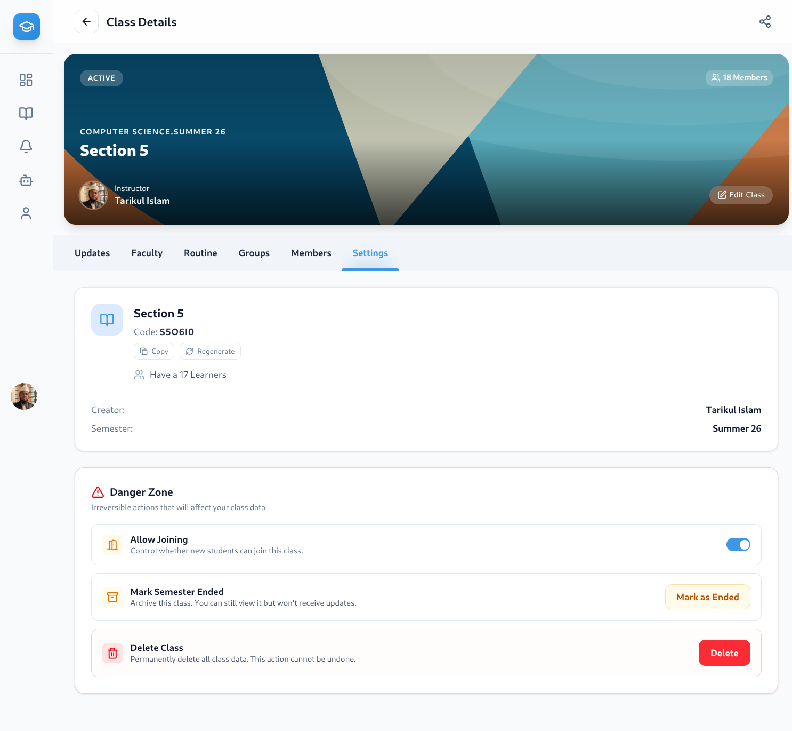

### Profile

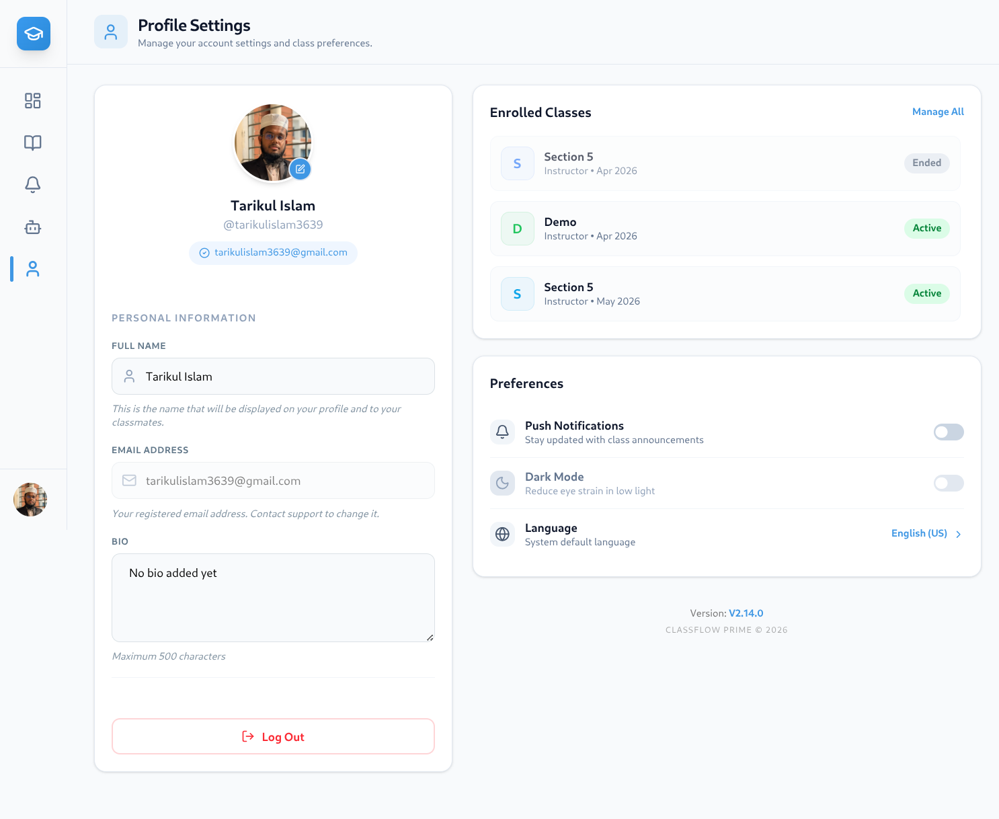

### Class Routine

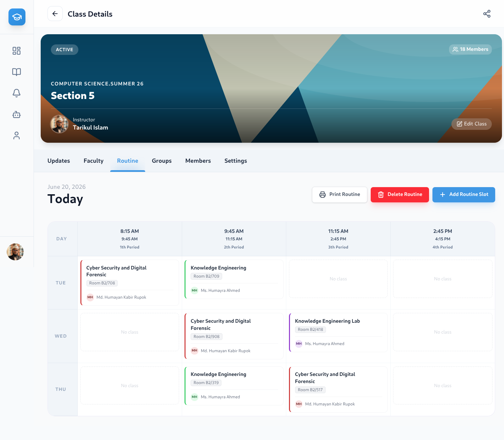

### Class Update

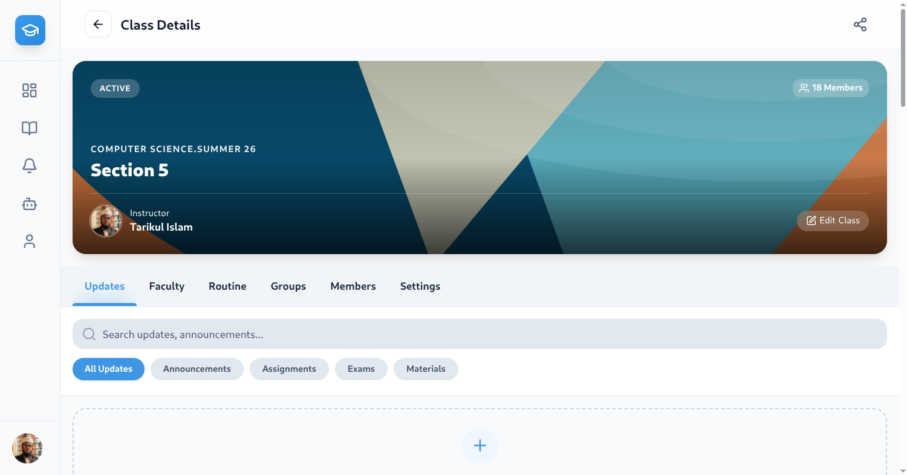

### Class Update Page

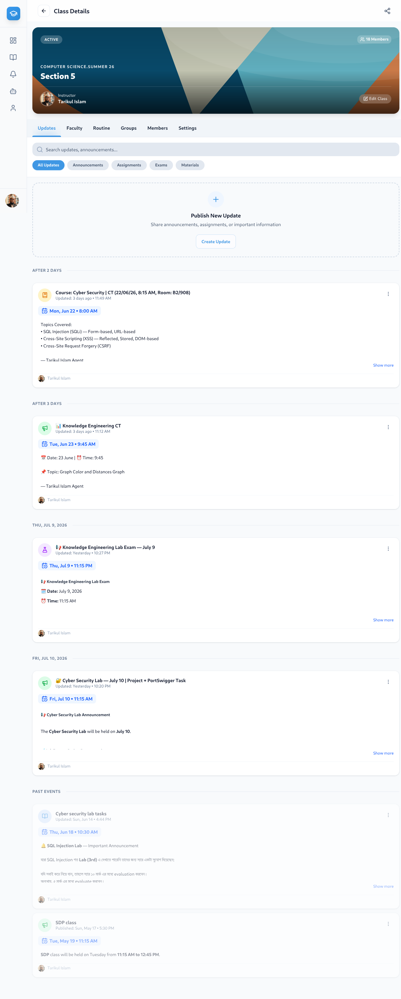

### Mobile Class Update

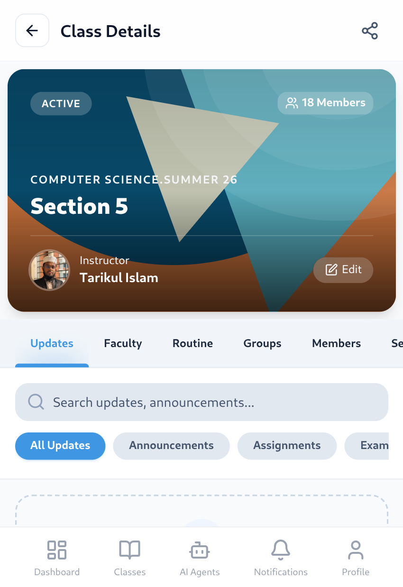

### Mobile Long Update

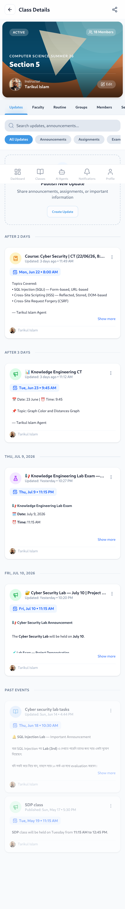

### Agent Page

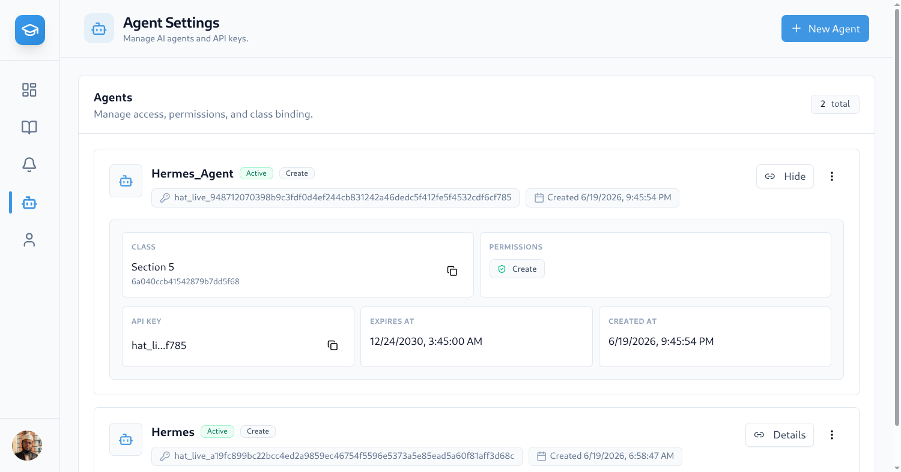

### Faculty Page

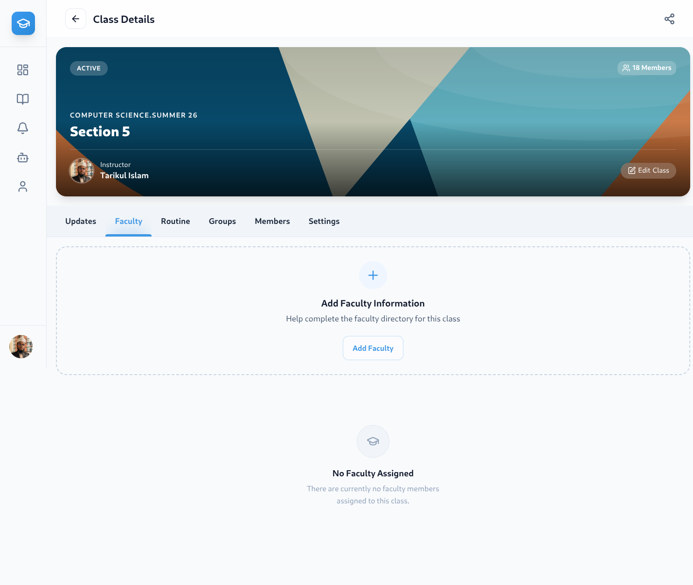

</div>

---

## Live Demo

**Live Site:** [https://classflow-prime.vercel.app](https://classflow-prime.vercel.app)

---

## Getting Started

### Prerequisites

- **Node.js** 18+ recommended
- **npm** or **yarn**
- **MongoDB Atlas** account (or local MongoDB)
- **Cloudinary** account (for media uploads)

### Installation

```bash
# 1. Clone the repository
git clone https://github.com/Tarikul3639/classflow-prime.git
cd classflow-prime

# 2. Install backend dependencies
cd server
npm install

# 3. Install frontend dependencies
cd ../web
npm install
```

### Environment Setup

#### Backend (`server/.env`)

Copy the example environment file and configure:

```bash
cd server
cp .env.example .env
```

Required environment variables:

| Variable | Description |
|---|---|
| `DATABASE_URI` | MongoDB connection string |
| `JWT_SECRET` | Secret key for JWT tokens |
| `JWT_EXPIRES_IN` | Token expiration (e.g., `7d`) |
| `SMTP_HOST` | SMTP server host |
| `SMTP_PORT` | SMTP server port |
| `SMTP_USER` | SMTP username |
| `SMTP_PASS` | SMTP password |
| `CLOUDINARY_CLOUD_NAME` | Cloudinary cloud name |
| `CLOUDINARY_API_KEY` | Cloudinary API key |
| `CLOUDINARY_API_SECRET` | Cloudinary API secret |
| `VAPID_PUBLIC_KEY` | Web Push VAPID public key |
| `VAPID_PRIVATE_KEY` | Web Push VAPID private key |
| `CLIENT_URL` | Frontend URL (e.g., `http://localhost:3000`) |

#### Frontend (`web/.env.local`)

```bash
cd web
cp .env.example .env.local
```

| Variable | Description |
|---|---|
| `NEXT_PUBLIC_API_URL` | Backend API URL (e.g., `http://localhost:4000`) |
| `NEXT_PUBLIC_VAPID_PUBLIC_KEY` | Web Push VAPID public key |

### Running Locally

```bash
# Terminal 1 — Start backend
cd server
npm run start:dev

# Terminal 2 — Start frontend
cd web
npm run dev
```

Visit [http://localhost:3000](http://localhost:3000) to see the app.

---

## Folder Structure

```
classflow-prime/
├── images/                          # Screenshots & static images
├── server/                          # NestJS backend
│   ├── src/
│   │   ├── config/                  # App configuration (DB, JWT, Mail, Cloudinary, etc.)
│   │   ├── common/                  # Shared guards, decorators, interceptors, pipes, middleware
│   │   ├── infrastructure/          # Database, Mail, Cloudinary modules
│   │   ├── modules/                 # Feature modules
│   │   │   ├── auth/                # Authentication & authorization
│   │   │   ├── class/               # Class CRUD, members, groups, updates, faculty, settings
│   │   │   ├── agent/               # AI agent management
│   │   │   ├── routine/             # Class schedule/routine
│   │   │   ├── dashboard/           # Dashboard aggregation
│   │   │   ├── profile/             # User profile management
│   │   │   └── notification/        # Notifications & push subscriptions
│   │   ├── app.module.ts            # Root module
│   │   └── main.ts                  # Application entry point
│   ├── package.json
│   └── tsconfig.json
├── web/                             # Next.js frontend
│   ├── src/
│   │   ├── app/                     # App Router pages & layouts
│   │   │   ├── (auth)/              # Auth pages (sign-in, sign-up, forgot-password)
│   │   │   ├── (main)/              # Main app pages (dashboard, classes, profile, notifications)
│   │   │   └── layout.tsx           # Root layout with metadata & SEO
│   │   ├── components/              # Reusable UI components
│   │   ├── hooks/                   # Custom React hooks
│   │   ├── store/                   # Redux store, slices, thunks
│   │   ├── types/                   # TypeScript type definitions
│   │   ├── utils/                   # Utility functions
│   │   └── api/                     # API client (Axios), Cloudinary helpers
│   ├── package.json
│   └── tsconfig.json
├── .github/workflows/               # CI/CD (semantic release)
├── README.md
└── package.json
```

---

## Author

**Tarikul Islam**

- **Portfolio:** [https://tarikul-islam.me](https://tarikul-islam.me)
- **GitHub:** [https://github.com/Tarikul3639](https://github.com/Tarikul3639)
- **LinkedIn:** [https://www.linkedin.com/in/tarikul3639](https://www.linkedin.com/in/tarikul3639)

---

<div align="center">

Built with ❤️ by **Tarikul Islam** — Full-Stack Developer

</div>
